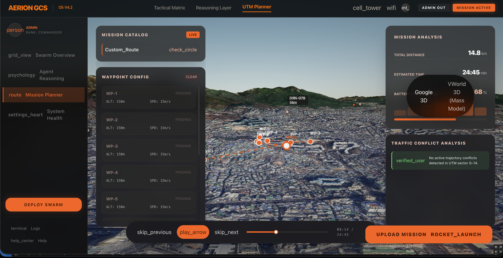
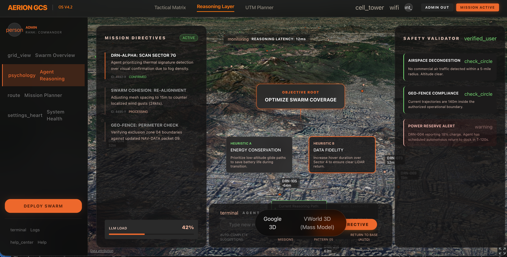

<div align="center">
  
  
  # 🦅 AERION Mind (Tactical Obsidian GCS)
  
  **대규모 스웜(Swarm) 관제 플랫폼을 위한 초고성능 3D 실시간 텔레메트리 대시보드**
</div>

---

## 🚀 프로젝트 소개 (Overview)

**AERION Mind**는 300대 이상의 다중 드론(Swarm)에서 쏟아지는 실시간 텔레메트리 데이터를 지연이나 프레임 드랍 없이 부드럽게 3D 지도 렌더링 환경에 투사해, 지휘관이 직관적으로 전술 관제를 수행할 수 있는 차세대 GCS(Ground Control Station) 인터페이스입니다.

React 생태계의 성능 한계를 극복하기 위해 가상 DOM을 완전히 우회하고, WebGL 엔진에 다이렉트로 메모리 포인터를 꽂아넣는 **역제어 패턴(preUpdate Loop Hooking)** 기술을 적용하여 극강의 퍼포먼스를 자랑합니다.


---

## 📸 스크린샷 및 주요 UI (Screenshots)

<p align="center">
  
  
</p>
<p align="center">
  
</p>

---

## 🛠 시스템 스펙 및 기술 스택 (Tech Stack)

### 프론트엔드 (Frontend)
- **Framework**: Next.js 16 (App Router), React
- **3D Rendering Engine**: Cesium.js (v1.95.0)
- **State Management**: Zustand (UI 리액티비티 배제 렌더링 최적화)
- **Styling**: TailwindCSS

### 백엔드 (Backend)
- **Framework**: FastAPI, Uvicorn
- **Concurrency**: WebSockets (`ws://`), 단방향 폴링 회피 브로드캐스트 패턴 적용
- **Data Validation**: Pydantic
- **Environment**: Python 3.12 (uv 패키지 매니저 기반)

### 인프라 및 배포 (Infra & Deployment)
- **Orchestration**: Docker, Docker Compose

---

## ⚡ 핵심 렌더링 최적화 기술 (Key Breakthroughs)

수백 대의 드론 객체를 React의 상태로 관리하면 `setState`로 인한 렌더 트리 재계산으로 브라우저가 마비됩니다. 이를 해결하기 위해 다음과 같은 기법을 적용했습니다:

1. **상태 관리의 이원화**: WebSocket 수신 데이터는 React 생명주기 밖인 Zustand의 내부 변수(`getState().drones`)에 조용히 기록됩니다.
2. **Cesium preUpdate Loop Hooking**: 렌더링 엔진(`CesiumViewer.tsx`)이 매 프레임 GPU를 그리기 직전에 호출되는 `preUpdate` 이벤트에 리스너를 달았습니다.
3. **Direct Memory Modification**: React를 거치지 않고 "날것의 메모리 주소"를 직접 읽어들여 3D 지도 상의 `PointPrimitive` 위치를 동기화하여 **프레임 부하 0%** 의 최적화를 달성했습니다.

---

## ⚙️ 환경 구성 및 실행 방법 (How to Run)

모든 실행 환경은 도커(Docker)로 완벽히 패키징되어 있어 호스트 환경의 복잡한 세팅 없이 즉각적인 배포가 가능합니다.

### 1. 저장소 클론 (Clone Repository)
```bash
git clone https://github.com/swjo0330/Aerion-Watch-3D.git
cd Aerion-Watch-3D
```

### 2. 도커 컨테이너 빌드 및 실행 (Docker Compose)
```bash
# 초기 실행 또는 코드 변경 후 실행 시 (반드시 --build 옵션 권장)
docker compose up -d --build
```

### 3. 접속 주소 및 포트 매핑
- **프론트엔드 (관제 UI)**: [http://localhost:3000](http://localhost:3000)
- **백엔드 (API 및 문서)**: `http://localhost:8000/docs`
- **초기 로그인 계정**: `Username: admin` / `Password: admin`

*(로그인 즉시 백엔드에서 생성된 수백 대의 드론 비행 시뮬레이터와 실시간 WebSockets 터널이 열리며 화려한 대시보드가 구동됩니다.)*

---

## 📝 License

이 프로젝트의 모든 권리 및 라이선스는 **SEONGWON JO (Paul)** 에게 있습니다.  
Copyright © SEONGWON JO (Paul). All Rights Reserved.
