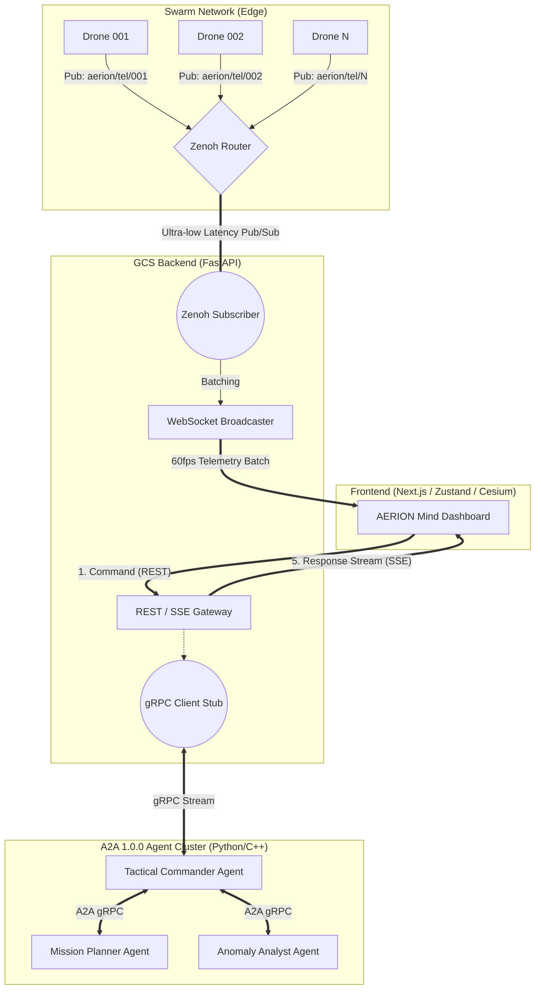

# 🦅 AERION Mind - Detailed Architecture Design (v1.0.0)
**Core Focus**: A2A gRPC Protocol & Zenoh Telemetry Pipeline

본 문서는 현재 개발된 **AERION Mind (FastAPI + Next.js)** 아키텍처에 **A2A(Agent-to-Agent) gRPC 통신망**과 **Eclipse Zenoh 기반 군집 드론 텔레메트리 파이프라인**을 결합하기 위한 상세 설계 문서입니다.

---

## 1. 전체 시스템 통합 아키텍처 다이어그램

기존의 단일 백엔드 모놀리식 구조를 탈피하여, LLM 연산은 `Agent Cluster`로, 데이터 처리는 `Zenoh Router`로 오프로딩하는 MSA(Microservice Architecture)로 전환합니다.



---

## 2. 서브시스템 1: A2A 1.0.0 gRPC 프로토콜 설계

LLM 에이전트 간의 통신과 백엔드-에이전트 통신의 안정성을 보장하기 위해 Protobuf(`.proto`) 기반의 강력한 데이터 컨트랙트를 정의합니다.

### 2.1 디렉터리 구조 개편안 (Backend)
```text
backend/
├── app/
│   ├── grpc/               # 신규: gRPC 관련 로직
│   │   ├── protos/         # .proto 스키마 파일 보관
│   │   ├── generated/      # protoc 컴파일러가 생성한 파이썬 코드
│   │   └── client.py       # FastAPI용 gRPC 비동기 클라이언트
```

### 2.2 Protobuf 스키마 설계 예시 (`a2a_agent.proto`)
LLM 통신의 핵심인 스트리밍(토큰별 반환)을 위해 `stream` 키워드를 사용합니다.

```protobuf
syntax = "proto3";

package a2a;

// 에이전트 서비스 정의
service TacticalAgent {
  // 백엔드가 에이전트에게 상황 판단을 요청하고 스트리밍으로 답변을 받음
  rpc AnalyzeSituation(SituationRequest) returns (stream ReasoningResponse) {}
  
  // 에이전트 간(A2A) 교차 검증 통신
  rpc CrossCheckPlan(PlanData) returns (ValidationResult) {}
}

message SituationRequest {
  string mission_id = 1;
  string commander_prompt = 2;
  bytes current_telemetry_snapshot = 3;
}

message ReasoningResponse {
  string token = 1;         // LLM이 뱉어내는 텍스트 토큰
  float confidence = 2;     // 확신도
  bool is_final = 3;        // 응답 종료 여부
}
```

> [!TIP]
> **설계 이점**: LLM이 JSON 형식을 틀리게 뱉어내도 Protobuf 파서에서 즉각 에러를 발생시켜 필터링하므로, 프론트엔드로 오염된 데이터가 넘어가는 치명적 버그를 원천 차단합니다.

---

## 3. 서브시스템 2: Zenoh 텔레메트리 파이프라인 설계

기존 `drone_simulator.py` 내부의 단순 `while` 루프를 분해하고, 수천 대의 외부 드론이 데이터를 쏘는 실제 운영 환경으로 전환합니다.

### 3.1 Topic Naming Convention (제논 토픽)
데이터 충돌 방지를 위해 REST의 URI와 유사한 계층형 토픽 구조를 사용합니다.
* `aerion/telemetry/drone/{drone_id}` : 고빈도 위치/상태 데이터 (10Hz)
* `aerion/event/drone/{drone_id}` : 배터리 경고, 이탈 등 저빈도 이벤트

### 3.2 FastAPI 연동 (Zenoh Subscriber)
Python 백엔드에 `zenoh-python` 패키지를 설치하여 비동기 구독 환경을 구축합니다.

```python
import zenoh
import asyncio

async def start_zenoh_subscriber():
    # 제논 라우터 연결
    session = zenoh.open(zenoh.Config())
    
    # aerion/telemetry 하위의 모든 드론 트래픽을 구독 (Wildcard '*')
    sub = session.declare_subscriber("aerion/telemetry/drone/*", telemetry_handler)
    
    print("Zenoh Subscriber Connected.")

def telemetry_handler(sample):
    # 제논에서 들어온 바이너리 데이터를 디코딩
    payload = sample.payload.decode('utf-8')
    drone_id = str(sample.key_expr).split("/")[-1]
    
    # 1. 메모리(Redis 또는 전역 dict) 갱신
    # 2. WebSocket Connection Manager로 넘겨 프론트엔드에 배치(Batch) 브로드캐스트
    update_drone_state(drone_id, payload)
```

---

## 4. 단계별 마이그레이션(구현) 전략

현재 프로젝트의 안정성을 깨지 않고 점진적으로 도입하기 위한 순서입니다.

1. **Phase 1 (gRPC 뼈대 구축)**: `backend` 폴더 내에 `.proto` 파일을 정의하고, 임시 모의(Mock) gRPC 에이전트 서버를 파이썬으로 띄워 FastAPI와 통신 테스트를 진행합니다.
2. **Phase 2 (Zenoh 시뮬레이터 분리)**: 현재 `drone_simulator.py`를 아예 별개의 파이썬 프로세스(가상의 드론 스웜)로 분리하고, Zenoh Publisher로 개조합니다.
3. **Phase 3 (프론트엔드 SSE 연결)**: React의 `Reasoning Layer` 패널 쪽에서 LLM 답변을 실시간으로 타이핑 쳐서 보여줄 수 있도록 FastAPI - Next.js 구간에 SSE(Server-Sent Events) API를 뚫습니다.
4. **Phase 4 (LLM 연동 및 A2A 구현)**: 실제 LangChain이나 LlamaIndex를 사용해 gRPC 에이전트 내부에 추론 로직을 입히고, 에이전트 간 통신(A2A)을 검증합니다.
